# Flag Edu

## 프로젝트 소개

Flag Edu는 여러 교육 워크스페이스의 수업·일정, 코치 보고서, 관리자의 전체 조회·편집과 내보내기를 한곳에서 관리하는 모바일 우선 PWA입니다. 업무 구조는 `워크스페이스 → 수업 → 일정 → 보고서`입니다. 별도의 보고서 승인 단계 없이 임시저장과 제출로 기록을 관리합니다.

- 관리자 초대로만 가입하는 폐쇄형 서비스입니다.
- 관리자와 코치는 수업 기본정보와 실제 일정을 나누어 관리하고, 일정은 목록 또는 월간 캘린더로 확인합니다.
- 코치는 수업별 보고서를 임시저장·수정·제출하고 사진을 첨부합니다.
- 관리자는 전체 보고서, 동적 보고서 양식, 구성원 권한, PDF·Excel 내보내기를 관리합니다.
- 한 계정으로 여러 워크스페이스에 참여하고 워크스페이스마다 다른 관리자·코치 역할을 가질 수 있습니다.
- 워크스페이스·역할·작성자 기준 권한은 화면뿐 아니라 PostgreSQL RLS와 RPC에서도 검사합니다.

## 사용 기술

| 영역 | 기술 |
| --- | --- |
| 프론트엔드 | Next.js 16.3.8 App Router, React 19.2.8, TypeScript, Tailwind CSS 4 |
| 인증·데이터 | Supabase Auth, PostgreSQL, Row Level Security, RPC |
| 파일 | Supabase Storage, `pdf-lib`, ExcelJS |
| 품질 | Vitest, Testing Library, PGlite, ESLint, Playwright·Chrome·WebKit, Aside QA 실행기 |
| 운영 | Vercel, Vercel Cron, 설치형 PWA |

## 앱 기능 가이드

아래 사진은 실제 앱에 전용 QA 관리자·코치 계정으로 로그인해 캡처한 예시입니다. 계정명·이메일·워크스페이스 식별 정보는 문서용 예시로 익명화했고, 사진은 개인이 등장하지 않는 합성 이미지입니다. 수업명·건수·날짜와 화면 상태는 사용 데이터에 따라 달라집니다.

캡처는 **iPhone 18 Pro 크기 근사**, 앱 콘텐츠 전용 402×874 CSS px·DPR 3(이미지 1206×2622 px)로 통일했습니다. [Apple 규격](https://www.apple.com/iphone-18-pro/specs/)의 해상도를 3배율로 환산한 크기이며, 설치된 `iPhone 17 Pro` WebKit 프로필을 사용했습니다. 실제 iPhone 18·iOS 27 Safari, 주소창·키보드·PWA 설치 검증을 뜻하지 않습니다. 캡처 환경·이미지 무결성 정보는 [문서 이미지 매니페스트](docs/images/guide-manifest.json)에 있습니다.

### 공통

#### 1. 워크스페이스

- 모든 업무 데이터는 현재 선택한 워크스페이스에 속합니다.
- 상단에서 현재 워크스페이스를 확인하며, 참여 중인 곳이 둘 이상이면 목록에서 전환합니다.
- 전환하면 홈, 수업, 일정, 보고서, 양식, 구성원과 내보내기 범위가 함께 바뀝니다.
- 같은 계정도 워크스페이스 A에서는 관리자, B에서는 코치가 될 수 있습니다.
- 현재 선택은 계정 전체에 적용됩니다. 다른 탭에서 전환하면 이미 열린 업무 탭도 새 워크스페이스의 홈으로 자동 이동합니다. 이전 편집 화면의 미저장 입력은 자동 저장하지 않습니다. 탭 복귀·페이지 복원 시 다시 확인하며, 활성 화면에서는 30초 주기로 알림 누락을 보완합니다. DB에서도 이전 범위의 쓰기를 계속 차단합니다.

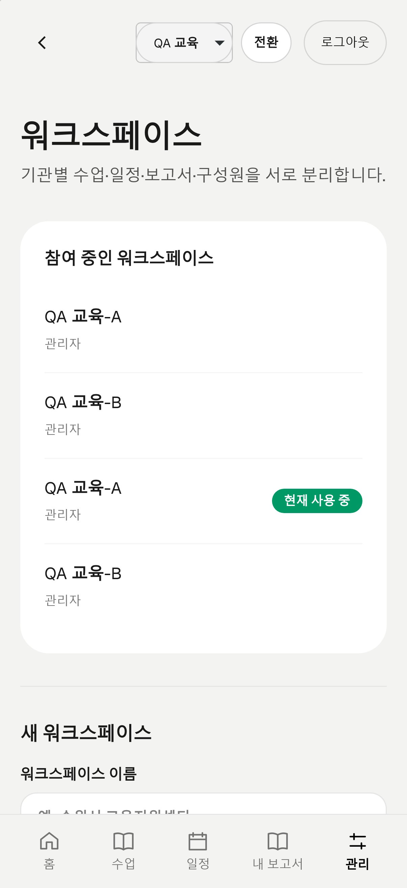

#### 2. 로그인과 계정

- 루트 주소에 접속하면 로그인 화면으로 바로 이동합니다.
- 회원가입은 관리자 계정의 이메일 초대로만 가능합니다. 로그인 화면에서는 비밀번호 복구 링크 아래에서 안내합니다.
- 초대받은 사용자는 이메일 링크에서 비밀번호를 설정한 뒤 로그인합니다.
- 비밀번호 설정 전 `pending` 사용자는 업무 데이터에 접근할 수 없습니다.
- 로그인 후 상단 또는 하단 메뉴에서 `홈`, `수업`, `일정`, `내 보고서`로 이동합니다.

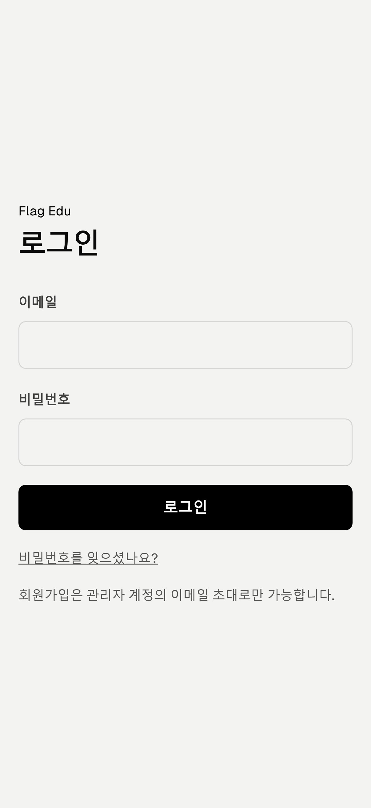

#### 3. 홈 대시보드

다가오는 수업, 임시저장 보고서 수, 가까운 수업 일정과 최근 기록을 한 화면에서 확인합니다. `수업 확인 · 기록하기`를 누르면 해당 수업 상세로 이동합니다.

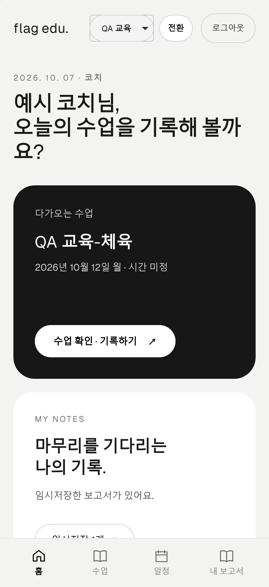

#### 4. 수업 일정

- `목록`은 기간·상태 필터와 최신순·오래된순 정렬을 제공하며 기본값은 최신순입니다. `필터 초기화`는 시작일·종료일을 비우고 상태는 전체, 정렬은 최신순으로 되돌립니다.
- `목록`과 `캘린더`는 같은 카드 모양으로 수업명, 장소, 날짜·시간과 상태를 보여 줍니다.
- `캘린더`는 오늘을 기본 선택하고, 날짜를 누르면 그 날짜의 수업만 달력 아래에 표시합니다.
- 목록/캘린더 보기 선택은 다른 페이지를 다녀와도 브라우저에 유지됩니다.
- 수업 상태는 `예정` 노랑, `취소` 빨강, `완료` 초록으로 구분하며 종료 시각이 지난 일정은 자동으로 완료 처리됩니다.
- 시간 미정 수업에는 임의의 자정 대신 `시간 미정`을 표시합니다.

목록과 필터:

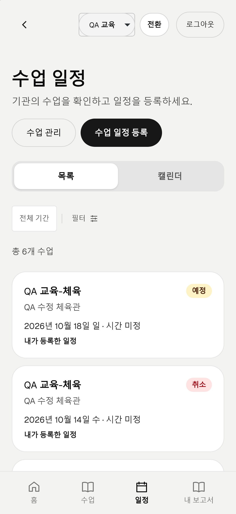
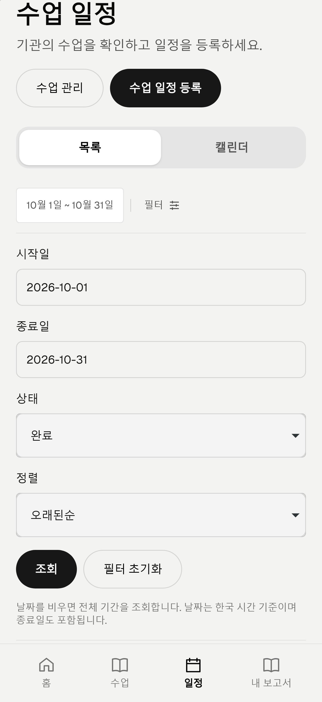

월간 캘린더에서 날짜를 선택하면 그 날짜의 일정만 아래에 표시합니다. 아래 목록이 화면 아래에 있다면 스크롤해서 확인합니다.

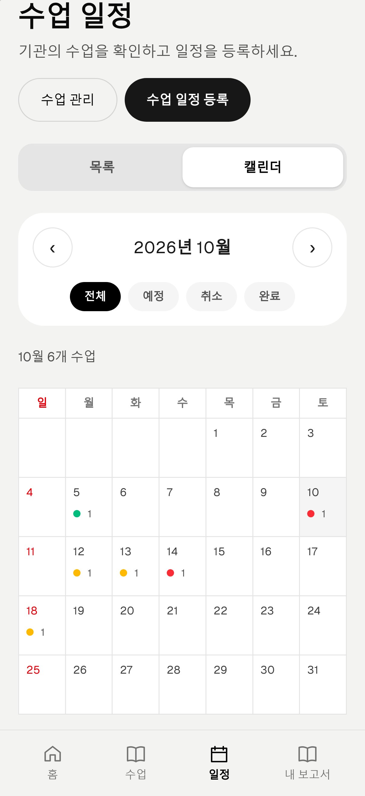

#### 5. 수업과 수업 일정 등록

`수업`에서는 여러 일정이 공통으로 사용할 수업명, 장소, 진행방식과 메모를 먼저 등록합니다. `일정`의 `수업 일정 등록`은 저장된 수업을 선택한 뒤 다음 3단계로 진행합니다.

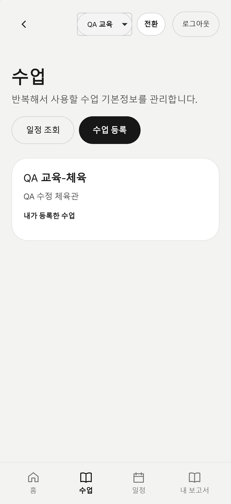
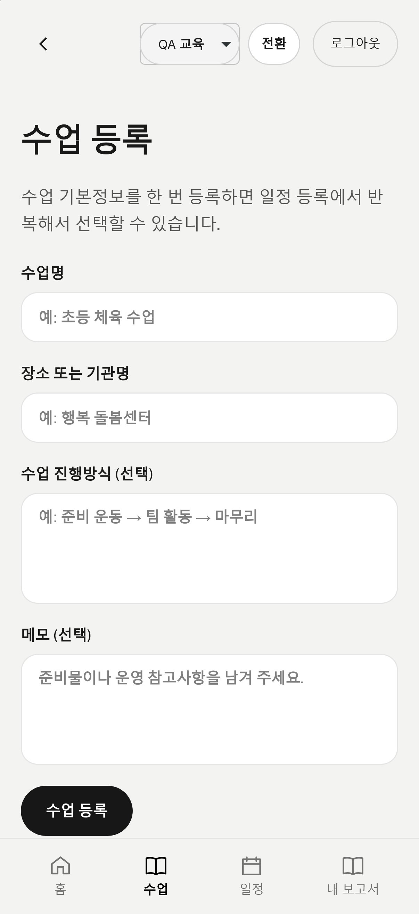

1. 등록된 수업 선택
2. 반복과 날짜·시간 입력
3. 생성될 일정을 확인한 뒤 등록

반복은 없음·일·주·월 중 선택할 수 있습니다. 반복 유형에 따라 간격, 시작·종료일, 요일 또는 매월 날짜가 같은 화면에 자동으로 표시됩니다. 주간 반복은 여러 요일을 선택할 수 있고, 월간 반복에서 해당 날짜가 없는 달은 말일을 사용합니다. 진행방식과 메모는 선택한 수업 기본정보에서 일정으로 복사됩니다.

`얼마나 자주 진행하나요?` 단계에서 반복 선택 바로 아래의 세부 조건을 입력합니다. 다음 단계에서는 생성될 날짜를 확인하며, 마지막 등록 버튼을 누르기 전에는 저장하지 않습니다.

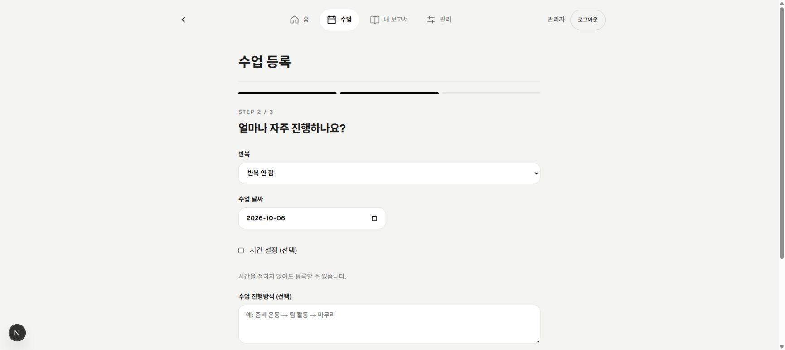

#### 6. 권한 요약

| 기능 | 관리자 | 코치 |
| --- | :---: | :---: |
| 홈·현재 워크스페이스 수업 목록·캘린더 조회 | O | O |
| 수업 기본정보·일정 등록 | O | O |
| 현재 워크스페이스 수업 수정·취소 | 모든 수업 | 본인이 등록한 수업 |
| 보고서 작성·답변·사진 관리 | 현재 워크스페이스의 모든 보고서 | 본인 보고서 |
| 현재 워크스페이스 전체 보고서 조회 | O | X |
| 보고서 양식 관리 | O | X |
| 워크스페이스 생성·구성원·권한 관리 | O | X |
| PDF·Excel 내보내기 | O | X |

다른 워크스페이스 데이터와 코치의 다른 작성자 보고서 수정은 DB 정책에서도 차단합니다. 관리자는 현재 워크스페이스의 수업·보고서·사진·구성원을 편집할 수 있습니다. 취소된 수업은 기존 기록만 보존하며 보고서 답변·사진을 더 이상 변경하거나 제출할 수 없습니다.

### 관리자

관리자에게는 공통 메뉴에 `관리`가 추가됩니다. 관리 허브에서 전체 보고서, 보고서 양식, 구성원, 내보내기, 워크스페이스로 이동합니다.

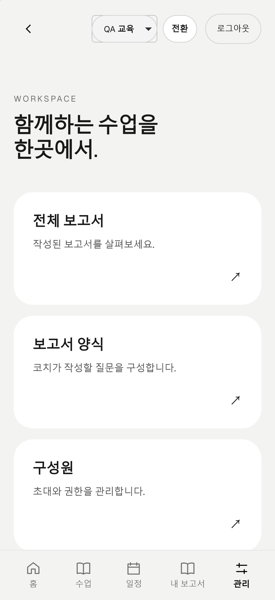

#### 1. 전체 보고서

- 현재 워크스페이스의 모든 작성자 보고서를 조회합니다.
- 기간, 작성자와 수업으로 결과를 좁힙니다.
- 관리자는 다른 사용자의 보고서 답변을 수정·제출하고 사진을 추가·삭제할 수 있습니다.

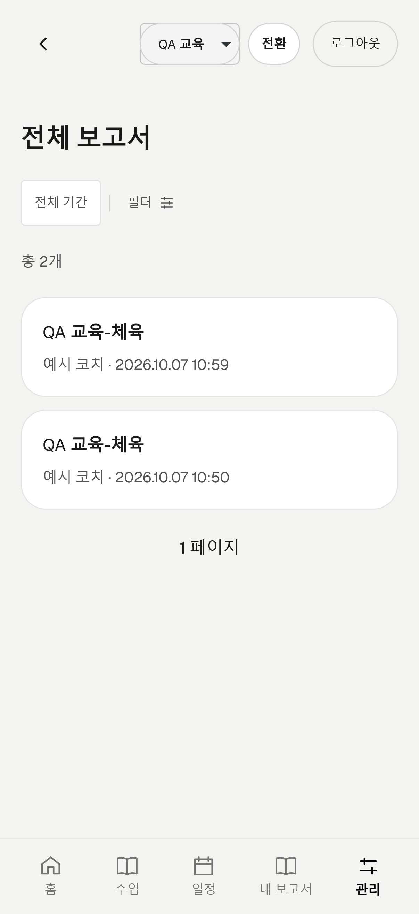

#### 2. 보고서 양식

- 양식 이름과 최대 50개 필드를 구성합니다.
- 짧은 글, 긴 글, 숫자, 날짜, 단일 선택, 복수 선택, 사진 필드를 지원합니다.
- 사진 필드는 허용 장수를 설정하고, 단일·복수 선택지는 행 단위 추가·삭제 UI로 관리합니다.
- 화면에서는 하나의 양식을 조회·수정하는 흐름으로 보이며 내부 버전 번호는 표시하지 않습니다. 사용 중인 양식은 초록 배지로 강조합니다.
- 수정할 때 내부적으로 새 버전을 보존하므로 과거 보고서는 작성 당시 구조를 계속 사용합니다.
- 삭제한 양식은 실제 기록을 지우지 않고 비활성화하여 양식 목록과 새 보고서 작성에서 숨깁니다.

양식 목록과 선택지 편집 예시입니다. QA에서 비활성화한 양식은 목록에서 보이지 않습니다. 등록·수정 뒤 `미리보기`로 입력 형태를 확인하고, 새 보고서에 적용하려면 게시 확인 후 저장합니다.

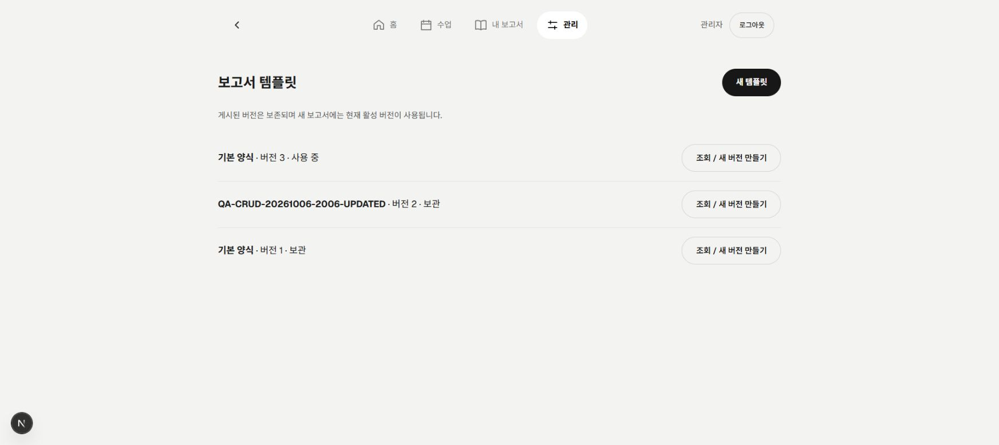
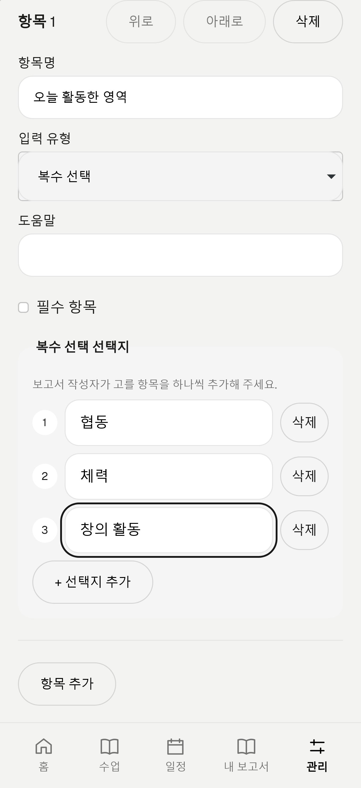

#### 3. 구성원

- 이름과 이메일을 입력해 코치를 초대합니다.
- 이미 다른 워크스페이스에 가입한 이메일은 Auth 사용자를 중복 생성하지 않고 현재 워크스페이스의 코치로 추가합니다.
- 대기 구성원에게 초대 또는 비밀번호 설정 메일을 다시 보냅니다.
- 활성 구성원의 코치·관리자 역할과 활성·비활성 상태를 변경합니다.
- 마지막 활성 관리자를 코치로 내리거나 비활성화하는 동작은 차단됩니다.

역할·상태 변경은 구성원의 `권한·상태 변경`을 열어 값을 선택하고 변경 확인 후 적용합니다. 비활성화는 해당 워크스페이스의 이용을 제한하는 것이며 다른 활성 소속을 삭제하지 않습니다.

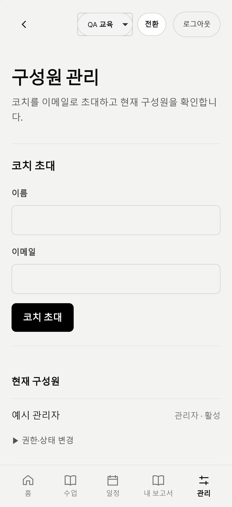

#### 4. 워크스페이스

- 현재 계정이 참여한 워크스페이스와 각각의 역할을 확인합니다.
- 관리자는 새 워크스페이스를 만들 수 있으며 새 워크스페이스의 관리자로 즉시 전환됩니다.
- 워크스페이스마다 구성원 역할과 상태, 수업·일정·보고서·양식이 독립적으로 관리됩니다.

#### 5. PDF·Excel 내보내기

- 수업 시작일, 종료일, 작성자와 수업으로 보고서 범위를 선택합니다.
- 한 번에 최대 200개 보고서를 Excel 또는 PDF로 생성합니다.
- PDF는 보고서별 양식 순서, 긴 글 자동 높이, 사진 1열 배치와 페이지 분할을 적용합니다.
- PDF에 포함할 원본 사진 합계는 100MiB까지 허용합니다.
- 일부 사진 로딩 실패 시 나머지 PDF는 만들고 첫 페이지와 해당 행에 경고를 표시합니다.
- 생성한 파일은 브라우저로 바로 내려보내고 서버나 Storage에 보관하지 않습니다. 과거 버전에서 저장된 파일만 일일 정리 작업이 제거합니다.

파일은 다운로드한 기기에서 보관합니다. 새 내보내기에는 서버 저장 이력·재다운로드·7일 보관 기한이 없으며, 이전 방식의 파일 정리 작업과는 별개입니다.

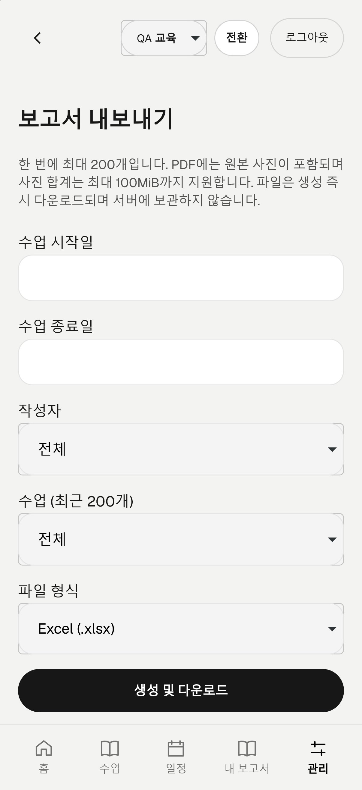

### 코치

코치에게는 `홈`, `수업`, `일정`, `내 보고서`가 표시됩니다. `/manage`, `/members`, `/templates`, `/admin-reports`, `/exports`, `/workspaces` 같은 관리자 주소에 직접 접근해도 홈 또는 내 보고서로 되돌아갑니다. 참여한 워크스페이스 전환은 상단에서 사용할 수 있습니다.

#### 1. 수업 관리

- 수업 기본정보를 등록한 뒤 해당 수업의 단일·반복 일정을 등록합니다.
- 현재 워크스페이스 일정을 목록과 캘린더로 확인합니다.
- 본인이 등록한 수업만 수정하거나 취소할 수 있습니다.
- 수업 상세에서 보고서가 없으면 `보고서 작성`, 있으면 기존 보고서 링크가 표시됩니다.

#### 2. 보고서 작성

- 본인의 보고서만 조회하고 수정합니다.
- 필수 항목이 덜 채워져도 `임시저장`할 수 있습니다.
- `제출`할 때 필수 답변과 필수 사진을 검증합니다.
- 제출한 보고서를 다시 수정하면 임시저장 상태로 돌아가며 재제출이 필요합니다.
- 같은 보고서를 오래된 화면에서 저장하면 덮어쓰지 않고 새로고침 안내를 즉시 표시합니다.

작성 흐름은 `일정 상세 → 보고서 작성 → 답변·사진 입력 → 임시저장 또는 제출`입니다. 기존 보고서는 기본 조회 화면에서 수정으로 진입합니다. 취소된 일정의 보고서는 조회만 가능하며 수정·제출 버튼을 제공하지 않습니다.

조회 화면은 답변을 중심으로 읽는 문서형 레이아웃입니다. 양식 순서대로 항목을 구분하고 선택값은 칩, 숫자·날짜는 간결한 행으로 표시합니다. 빈 값은 `미입력`으로 표시하고 숫자 0은 그대로 유지합니다.

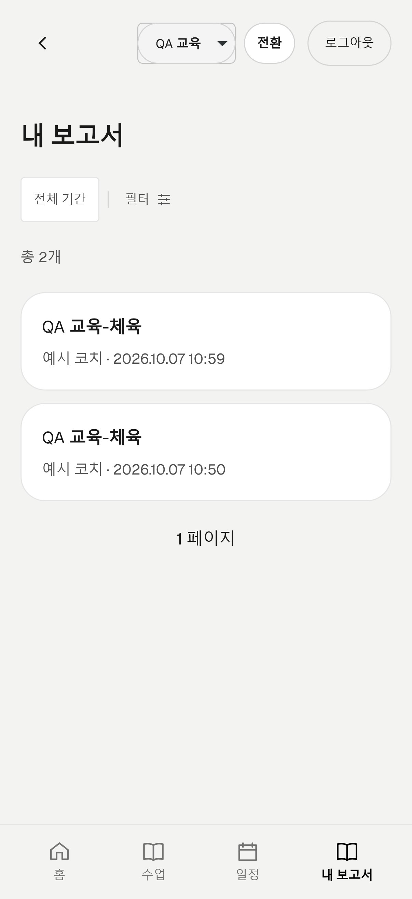

아래는 보존된 QA 보고서 조회 예시입니다. 취소 일정에 연결된 보고서는 답변·사진이 유지되고 읽기 전용으로 표시됩니다.

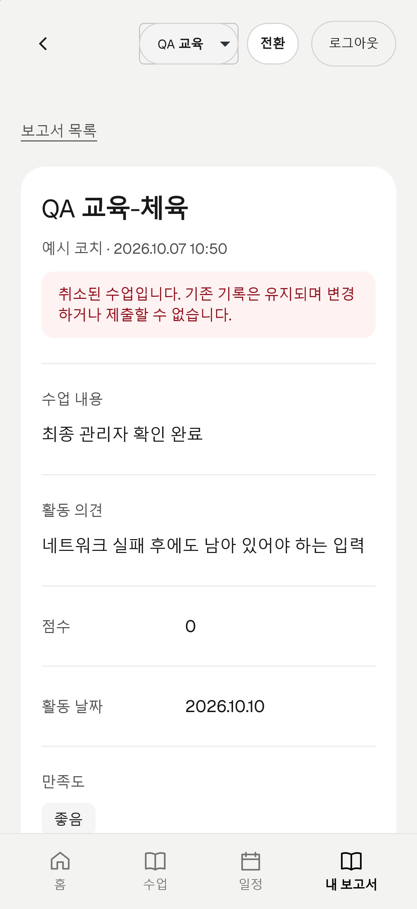

#### 3. 사진

- `사진 추가`에서 브라우저가 읽을 수 있는 25MiB 이하 이미지를 선택합니다. 앱이 긴 변 최대 1280px·1MiB 이하 JPEG로 자동 축소한 뒤 업로드하며, 필드별 허용 장수를 검사합니다.
- 사진은 작은 가로 썸네일 목록으로 표시되며 화면 폭을 넘으면 좌우로 스크롤합니다.
- 썸네일을 누르면 앱 안에서 크게 볼 수 있습니다. `닫기`, Escape 또는 배경 클릭으로 닫으면 원래 썸네일로 돌아옵니다. 취소된 수업의 기존 사진도 확대 조회할 수 있습니다.
- 업로드 전 사진을 빠르게 축소하고, 성공한 썸네일은 전체 페이지를 다시 불러오지 않고 즉시 추가합니다.
- 업로드 순서는 `created_at`, `id` 기준으로 고정됩니다.
- 삭제 확인은 브라우저 기본창이 아니라 앱 안의 확인 대화상자를 사용합니다.
- 사진을 추가하거나 삭제하면 제출된 보고서도 임시저장 상태가 되어 재제출해야 합니다.
- 취소 수업의 기존 보고서는 답변과 사진을 읽을 수만 있고 추가·삭제할 수 없습니다.

사진 추가·삭제는 본문 저장과 별도로 즉시 반영됩니다. 업로드·삭제가 끝난 뒤 임시저장 또는 제출을 진행합니다. 실제 HEIC 지원, 카메라 권한과 촬영 동작은 기기·브라우저에서 추가 확인이 필요합니다.

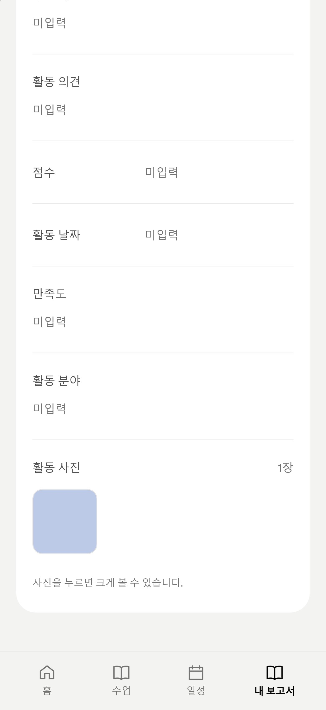

## 로컬 실행

Node.js 24 이상과 npm이 필요합니다.

```bash
npm ci
copy .env.example .env.local
npm run dev
```

브라우저에서 `http://localhost:3000`에 접속합니다.

### 환경변수

| 이름 | 공개 여부 | 역할 |
| --- | --- | --- |
| `NEXT_PUBLIC_SUPABASE_URL` | 브라우저 공개 | 연결할 Supabase 프로젝트 API 주소 |
| `NEXT_PUBLIC_SUPABASE_PUBLISHABLE_KEY` | 브라우저 공개 | 로그인과 RLS 범위의 클라이언트 요청에 사용하는 Publishable Key |
| `NEXT_PUBLIC_SITE_URL` | 브라우저 공개 | 초대·비밀번호 설정 콜백을 생성할 앱 기준 주소 |
| `SUPABASE_SECRET_KEY` | 서버 전용 | 관리자 초대와 서버 관리 작업에 사용하는 Supabase Secret Key |
| `CRON_SECRET` | 서버 전용 | Vercel Cron 정리 API 호출을 인증하는 16자 이상의 무작위 문자열 |

```text
NEXT_PUBLIC_SUPABASE_URL=https://your-project-ref.supabase.co
NEXT_PUBLIC_SUPABASE_PUBLISHABLE_KEY=your-publishable-key
NEXT_PUBLIC_SITE_URL=http://localhost:3000
SUPABASE_SECRET_KEY=your-server-only-secret-key
CRON_SECRET=replace-with-a-random-string-at-least-16-characters
```

`.env.local`, DB 비밀번호, Secret Key, 기존 `service_role` 키, 로그인 정보는 Git에 커밋하지 않습니다. 다른 PC에서 작업할 때는 `.env.example`을 복사한 뒤 승인된 별도 채널로 전달받은 실제 값을 다시 설정합니다.

## Supabase 설정

### 마이그레이션

```bash
npx supabase login
npx supabase link --project-ref <PROJECT_REF>
npx supabase migration list --linked
npx supabase db push
```

적용 전 연결된 프로젝트와 미적용 마이그레이션을 반드시 확인합니다.

### Auth URL

운영 전 Supabase Authentication의 공개 회원가입을 끄고 URL Configuration을 설정합니다.

```text
Site URL: https://flag-edu-prototype.vercel.app
Redirect URL: http://localhost:3000/auth/callback
Redirect URL: http://localhost:3000/**
Redirect URL: https://flag-edu-prototype.vercel.app/auth/callback
Redirect URL: https://flag-edu-prototype.vercel.app/**
```

Vercel Preview에서 인증을 시험한다면 해당 Preview 패턴을 별도로 추가합니다. 허용되지 않은 콜백은 Supabase의 Site URL로 대체되어 초대 링크가 잘못된 화면으로 이동할 수 있습니다.

### 최초 기관과 관리자

초기 마이그레이션 뒤 Supabase Auth 사용자를 만든 다음 기관과 관리자 프로필을 연결합니다. 로컬 서버 환경변수가 준비되어 있으면 다음 명령을 사용할 수 있습니다.

```bash
npm run bootstrap:admin -- <AUTH_USER_UUID>
```

이후 코치는 앱의 `구성원 관리`에서 이메일로 초대합니다.

## 검증

개발 모드의 React Server Component 음수 시간 계측 결함([React #37561](https://github.com/react/react/issues/37561))은 Next 16.3.8에 맞춘 제한적 소스 패치로 보완합니다. `npm ci`/`npm install` 후 자동 적용되며, `npm run dev` 시작 전에도 확인합니다. 계산되지 않은 aborted/errored 계측만 정상 렌더 계측과 동일한 조건으로 건너뛰며 실제 예외·오류 화면·정상 성능 측정은 유지합니다. 전역 `performance.measure` 재정의나 오류 숨김은 사용하지 않습니다.

패치는 개발용 Flight 클라이언트 6개에만 적용하고 운영 번들은 변경하지 않습니다. Next 버전·원본 SHA-256이 다르면 설치를 실패시켜 검토를 요구합니다. Next를 업데이트할 때 공식 수정 포함 여부를 확인한 후 [패치 스크립트](scripts/patch-next-rsc-performance.mjs)와 `postinstall`/`predev`를 함께 제거하거나 갱신하세요. `--ignore-scripts` 설치 후에는 개발 서버 시작 또는 패치 스크립트를 직접 실행해야 합니다.

모바일 하단 홈 메뉴를 가리는 개발 배지는 `devIndicators: false`로 비활성화했습니다. 컴파일·런타임 오류 표시는 그대로 유지됩니다. 실제 메뉴/touch 비교 검증은 `scripts/qa-native-menu.mjs`를 사용하고, 로컬 빌드의 요청 취소 분석은 `node scripts/qa-local-server.mjs 3001`로 실행합니다. 이 서버 보조 도구의 요청 추적은 개발 앱·Vercel 운영에는 적용하지 않습니다.

개발(`http://localhost:3000`)과 운영 앱은 현재 같은 Supabase를 사용합니다. 테스트 업무 데이터는 별도 QA 워크스페이스에 격리하고 실사용자의 계정·권한·업무 데이터는 변경하지 않습니다. 환경별 Supabase 분리는 별도 운영 과제입니다.

```bash
npm run lint
npx tsc --noEmit
npm test
npm run build
npm audit --omit=dev --audit-level=high
```

Aside 브라우저 QA는 기본 조회 전용입니다.

```bash
npm run qa:aside
```

- [Aside QA 실행 안내](docs/aside-qa.md)
- [QA 피드백 루프](docs/qa-feedback-loop.md)

설치된 Playwright를 사용한 모바일 통합 검증·문서 캡처는 다음과 같이 실행합니다. 미리 승인된 `qa_fixture: true` 계정과 픽스처가 필요하며, 실제 이메일·비밀번호·세션 파일은 Git에 넣지 않습니다.

```powershell
node --env-file=.env.local scripts/qa-mobile-guide.mjs http://localhost:3000 <설치된-playwright-index.mjs-경로>
node --env-file=.env.local scripts/qa-mobile-guide.mjs https://flag-edu-prototype.vercel.app <설치된-playwright-index.mjs-경로>
```

이 실행기는 로그인, 관리자·코치 화면/차단, 필터 초기화, 날짜별 캘린더·보기 유지, 미저장 일정 미리보기·선택지 편집, 기존 사진 디코딩을 검증합니다. 성공하는 업무 등록·수정·제출·삭제, 권한 변경, 초대 메일, 내보내기 생성은 실행하지 않습니다. CRUD·실제 메일 E2E는 별도 쓰기 승인을 받아 수행하며, 과거 실행의 성공을 현재 환경의 성공으로 대신하지 않습니다.

기본 엔진은 WebKit이며 `QA_BROWSER=chromium`으로 설치된 Chrome 대조 실행도 가능합니다. WebKit의 native 요청 취소와 실제 예외는 별도로 기록하며, 같은 요청의 취소 증거가 없는 오류는 실패로 유지합니다. 문서 사진의 완성 여부와 브라우저 오류 게이트 통과 여부도 매니페스트에서 구분합니다. 최신 실행 범위·관찰 사항은 [QA 검증 기록](qa/aside/findings.md)을 확인하세요.

개발 모드와 빌드 모드의 차이를 확인할 때는 `npm run build` 후 `npm run start -- --port 3001`로 별도의 로컬 서버를 열고 위 실행기에 `http://localhost:3001`을 전달할 수 있습니다. 이는 운영 배포 검증이 아니며 문서용 사진을 교체하지 않습니다.

문서 캡처는 명시적으로 `QA_CAPTURE_DOCS=1`을 설정한 경우에만 `docs/images/`의 문서용 JPEG와 매니페스트를 갱신합니다. `QA_FIXTURE_RUN`은 승인된 픽스처 실행명, `QA_SOURCE_COMMIT`은 검증하는 앱 커밋입니다. 원본 로그·다운로드·세션은 Git 제외 `artifacts/aside/`에만 둡니다. 새 문서 사진의 존재·정확한 크기·해시·대체 텍스트는 자동 회귀로 검사합니다.

## 데모 데이터 교체

계정·프로필·기관은 보존하면서 수업, 보고서, 양식, 사진, 내보내기 이력을 현실적인 데모 시나리오로 교체할 수 있습니다. 기본 실행은 조회 전용 dry-run이며 현재 삭제 대상 건수만 보여 줍니다.

```bash
npm run seed:demo -- --admin-email=<관리자 이메일> --coach-email=<코치 이메일>
```

출력된 기관과 계정 역할, 삭제 대상 건수를 확인한 뒤에만 실제 교체 확인 문자열을 추가합니다.

```bash
npm run seed:demo -- --admin-email=<관리자 이메일> --coach-email=<코치 이메일> --confirm=REPLACE-DEMO-DATA
```

- 관리자 계정은 `admin/active`, 코치 계정은 `coach/active`로 맞춥니다.
- 다른 Auth 사용자와 모든 프로필·기관 정보는 삭제하지 않습니다.
- 기존 업무 데이터와 `report-images`, `report-exports` 객체는 제거합니다.
- 주간 기초반, 방문형 수업, 체험 수업, 시간 미정 워크숍, 우천 취소 일정과 제출·임시저장 보고서, 합성 활동 사진, XLSX 이력을 생성합니다.
- 서버 전용 `SUPABASE_SECRET_KEY`가 필요하며 실행 결과나 키를 커밋하지 않습니다.

## Vercel 배포

1. GitHub 저장소를 Vercel 프로젝트에 연결합니다.
2. Production과 Preview에 필요한 환경변수를 각각 등록합니다.
3. `main`을 배포하고 운영 주소에서 로그인·권한·초대 콜백을 확인합니다.
4. 설치형 PWA와 모바일 카메라 선택은 HTTPS 실기기에서 최종 확인합니다.

일일 운영 작업은 [vercel.json](vercel.json)의 UTC cron 식으로 실행됩니다. 종료된 일정을 완료 처리하고 과거 방식으로 남은 내보내기 파일을 정리합니다. 실행 시간을 바꾸려면 `crons[].schedule`을 수정하고 재배포합니다. 현재 `15 18 * * *`는 매일 UTC 18:15, 한국 시간 다음 날 03:15입니다.
