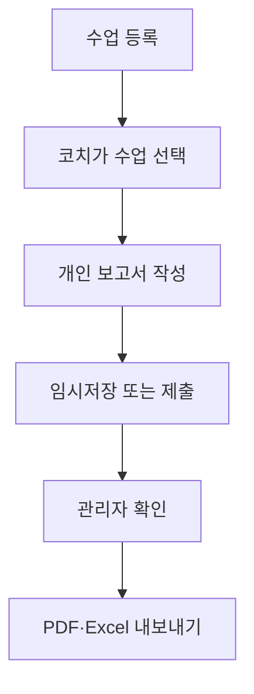
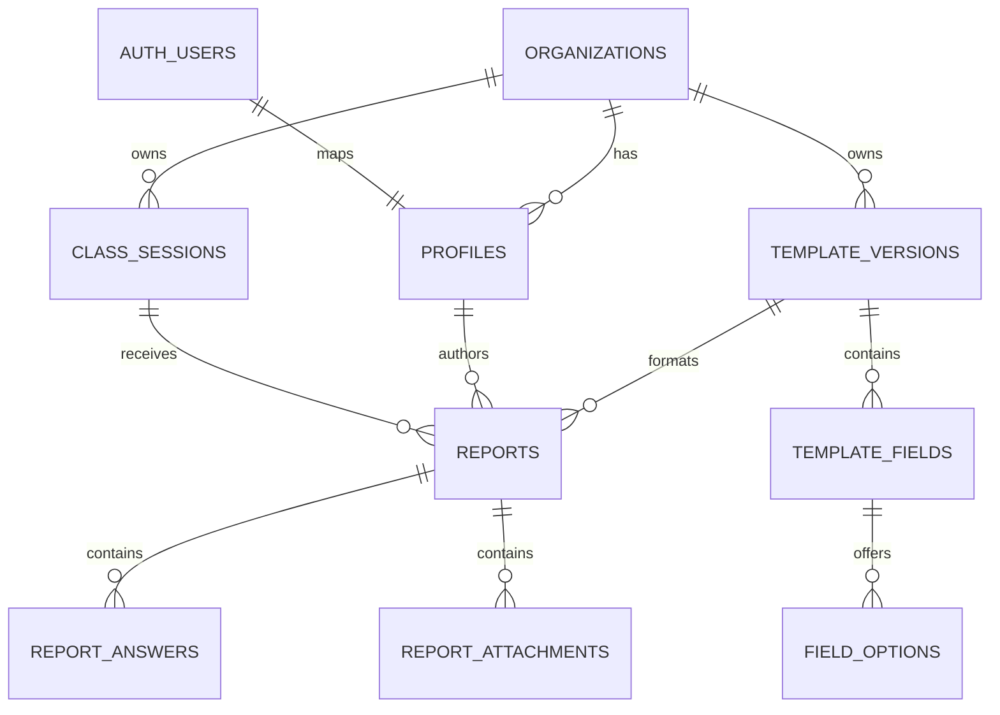

# Flag Edu 코치 수업 보고 앱

## Codex Cloud 개발 인수인계 명세서

- 문서 버전: 1.0
- 작성일: 2026-09-22
- 프로젝트 상태: Supabase 개발 프로젝트 생성 완료, 애플리케이션 구현 전
- 앱 개발 방향: Next.js 기반 모바일 우선 반응형 PWA, Vercel 배포
- 백엔드: Supabase
- GitHub 저장소: `lego812/flag-edu-prototype`

---

## 1. 프로젝트 목적

여러 코치가 소속된 체육관 또는 교육기관에서 수업 진행 결과를 통일된 양식으로 기록하고 관리하기 위한 내부 업무용 앱이다.

현재는 관리자가 코치들에게 카카오톡이나 정해진 문서 양식으로 보고를 받아 취합하고 있다. 이 과정에서 양식 누락, 개별 메시지 검색, 사진 정리, 월별 취합 등에 반복적인 수작업이 발생한다.

앱의 핵심 목적은 다음과 같다.

1. 수업 일정을 공동으로 등록한다.
2. 코치가 등록된 수업을 선택해 관리자가 만든 양식으로 개인별 보고서를 작성한다.
3. 관리자가 제출된 보고서를 확인하고 확인 처리한다.
4. 기간별 보고 내용을 PDF 또는 Excel로 취합해 내보낸다.

이 앱은 현재 단계에서 수강생 관리 시스템이 아니다. 수업과 코치의 보고 업무가 핵심이다.

---

## 2. 확정된 제품 요구사항

### 2.1 사용자와 권한

초기 사용자 유형은 두 가지다.

| 역할 | 설명 |
|---|---|
| 관리자(`admin`) | 보고 양식 관리, 전체 보고서 조회 및 확인, 구성원 권한 관리, 내보내기 수행 |
| 코치(`coach`) | 수업 조회·등록, 자신의 보고서 작성·제출 |

- 초기 사용자는 약 50명으로 예상한다.
- 현재는 관리자와 코치만 로그인한다.
- 수강생과 보호자의 로그인 및 보고서 열람 기능은 향후 확장 후보이며 MVP에서 제외한다.
- 모든 데이터는 소속 기관 단위로 격리한다.

### 2.2 수업 일정

- 활성 상태인 코치와 관리자는 누구나 수업 일정을 등록할 수 있다.
- 수업에 참여할 코치를 미리 지정하지 않는다.
- 반복 일정 기능은 MVP에서 제외한다.
- 수업 기본 정보는 다음과 같다.
  - 수업명
  - 장소 또는 기관명
  - 시작 일시
  - 종료 일시
  - 메모
  - 상태: 예정 / 취소
- 등록자는 자신의 수업을 수정하거나 취소할 수 있다.
- 관리자는 기관 내 모든 수업을 수정하거나 취소할 수 있다.
- 데이터 이력을 보존하기 위해 수업은 우선 물리 삭제 대신 `cancelled` 상태로 처리한다.

예시:

> 월요일 14시, 바비두 돌봄센터 수업

이 일정은 관리자가 아니어도 등록할 수 있으며, 해당 수업에 실제로 참여한 코치들이 각자 보고서를 작성한다.

### 2.3 보고서 작성

- 코치는 먼저 등록된 수업을 선택한다.
- 참여 코치 명단을 미리 설정하지 않으며, 활성 사용자는 누구나 해당 수업의 보고서를 작성할 수 있다.
- 보고서는 수업별·작성자별 하나만 존재한다.
- 같은 수업에 여러 코치가 참여한 경우 각 코치가 자신의 보고서를 하나씩 제출한다.
- 보고서는 임시저장(`draft`)과 제출(`submitted`) 상태를 가진다.
- 관리자는 제출된 보고서를 확인하고 확인자 및 확인 시각을 기록한다.
- 보고서가 수정되면 기존 관리자 확인 상태를 해제하여 재확인이 필요하도록 한다.
- 취소된 수업에는 새 보고서를 작성하거나 제출할 수 없다.

### 2.4 보고서 템플릿

- 관리자가 보고 내용을 템플릿으로 구성한다.
- 수업 유형별로 여러 템플릿을 지정하는 기능은 필요하지 않다.
- 기관별로 현재 사용 중인 활성 템플릿은 하나만 둔다.
- 템플릿은 버전으로 관리한다.
- 이미 발행된 템플릿 버전은 수정하지 않고, 변경 시 새 버전을 만들어 게시한다.
- 기존 보고서는 작성 당시 템플릿 버전을 계속 참조한다.

초기 지원 입력 유형:

| 유형 | 코드 | 설명 |
|---|---|---|
| 짧은 글 | `short_text` | 한 줄 입력 |
| 긴 글 | `long_text` | 여러 줄 입력 |
| 숫자 | `number` | 숫자 입력 |
| 날짜 | `date` | 날짜 선택 |
| 단일 선택 | `single_select` | 선택지 중 하나 |
| 복수 선택 | `multi_select` | 선택지 여러 개 |
| 사진 첨부 | `photo` | JPG 사진 첨부 |

각 필드는 다음 설정을 가질 수 있다.

- 항목명
- 도움말
- 필수 여부
- 정렬 순서
- 유형별 추가 설정
- 단일/복수 선택 항목의 선택지 목록
- 사진 필드의 최대 첨부 수(기본 3장)

### 2.5 사진

- 보고서당 휴대폰으로 촬영한 JPG 사진 약 3장을 예상한다.
- 저장소는 비공개 Supabase Storage 버킷을 사용한다.
- 현재 DB 마이그레이션의 파일당 상한은 1 MiB이며 MIME 유형은 `image/jpeg`만 허용한다.
- 모바일 브라우저에서 업로드 전에 JPEG로 변환하고 크기를 압축해야 한다.
- 권장 목표 크기는 사진당 약 200~400KB다. 1MiB는 허용 상한이지 목표 크기가 아니다.
- 저장 경로 규칙은 `{organization_id}/{report_id}/{uuid}.jpg` 형태로 한다.
- 작성자와 관리자만 사진을 읽을 수 있다.

### 2.6 관리자 확인

- 관리자는 기관 내 모든 제출 보고서를 조회할 수 있다.
- 미제출, 제출 완료, 관리자 확인 완료 상태를 구분해 필터링한다.
- 보고서 상세 화면에서 수업 정보, 작성자, 작성 내용, 사진을 확인한다.
- 제출 보고서만 확인 처리할 수 있다.
- 확인 완료 후 작성자가 내용을 변경하면 확인 상태가 해제된다.

### 2.7 내보내기

- 관리자는 기간과 조건을 선택해 보고 내용을 취합한다.
- 최종 지원 형식은 PDF와 Excel(`.xlsx`)이다.
- 내보내기에는 최소한 다음 정보가 포함되어야 한다.
  - 수업명 및 장소
  - 수업 일시
  - 보고 작성자
  - 제출 및 확인 상태
  - 템플릿 질문과 답변
  - 첨부 사진 정보
- 구체적인 PDF 레이아웃과 Excel 열 구성은 코어 기능 완료 후 확정한다.
- 내보내기 작업 이력은 `export_jobs`에서 관리하도록 초기 스키마에 반영되어 있다.

---

## 3. MVP 범위와 제외 범위

### MVP 포함

- 이메일 기반 로그인
- 공개 회원가입 차단 및 관리자의 이메일 초대
- 관리자 / 코치 역할
- 기관 단위 데이터 격리
- 수업 목록·상세·등록·수정·취소
- 관리자의 단일 활성 보고 템플릿 구성 및 버전 관리
- 동적 보고서 작성·임시저장·제출
- JPG 사진 첨부 및 압축
- 관리자 보고서 목록·상세·확인
- 기간/상태/작성자/수업 기준 필터
- PDF 및 Excel 내보내기
- Android Chrome 및 iPhone Safari 설치·카메라 검증
- PC·태블릿 관리자 화면 대응

### MVP 제외

- 수강생 관리
- 보호자 계정 및 로그인
- 수강생별 보고서
- 보호자에게 링크 또는 카카오톡 자동 발송
- 출결, 결제, 수강권 관리
- 수업 참여 코치 사전 배정
- 반복 일정
- 수업 유형별 복수 템플릿
- 푸시 알림
- 오프라인 동기화
- 네이티브 Android/iOS 앱스토어 배포
- 완전한 오프라인 사용

### 향후 확장 후보

- 수강생 및 보호자 계정
- 수강생별 학습/훈련 이력
- 보호자 보고서 열람
- 반복 일정
- 알림과 제출 독촉
- 필요 시 PWA를 네이티브 앱으로 패키징
- 조직별 브랜딩
- 내보내기 예약 및 공유 링크

---

## 4. 핵심 사용자 흐름

### 4.1 코치

1. 로그인한다.
2. 수업 목록에서 등록된 수업을 조회한다.
3. 필요한 경우 새 수업을 등록한다.
4. 보고할 수업을 선택한다.
5. 현재 활성 템플릿을 기준으로 자신의 보고서를 생성한다.
6. 텍스트·숫자·날짜·선택·사진 항목을 입력한다.
7. 임시저장하거나 제출한다.
8. 자신의 보고서와 제출 상태를 조회한다.

### 4.2 관리자

1. 로그인한다.
2. 초기에 보고서 템플릿을 구성하고 게시한다.
3. 등록된 수업과 전체 제출 현황을 조회한다.
4. 제출된 보고서의 내용과 사진을 확인한다.
5. 문제가 없으면 확인 처리한다.
6. 기간과 필터를 정해 PDF 또는 Excel로 내보낸다.

### 4.3 기본 업무 흐름



---

## 5. 화면 요구사항

### 공통

- 스플래시 및 로그인 상태 확인
- 이메일 로그인
- 로그아웃
- 오류 및 네트워크 상태 표시
- 한국어 UI
- 시간대는 `Asia/Seoul`

### 코치/공통 화면

1. 홈
   - 오늘 또는 가까운 수업
   - 내 미제출 보고서
   - 최근 작성 보고서
2. 수업 목록
   - 날짜 범위 필터
   - 예정/취소 구분
3. 수업 상세
   - 수업 정보
   - 내 보고서 작성/계속 작성/조회 버튼
4. 수업 등록 및 수정
5. 보고서 작성
   - 템플릿 기반 동적 폼
   - 임시저장
   - 사진 촬영/선택/삭제
   - 필수값 검증
   - 제출
6. 내 보고서 목록 및 상세

### 관리자 화면

1. 보고서 현황
   - 기간, 수업, 작성자, 제출/확인 상태 필터
2. 보고서 상세 및 확인
3. 템플릿 편집
   - 필드 추가·삭제·순서 변경
   - 유형 및 필수 여부 설정
   - 선택지 설정
   - 미리보기
   - 게시
4. 구성원 목록
   - 역할 변경
   - 활성/비활성 변경
5. 내보내기
   - 기간 및 조건 선택
   - PDF/XLSX 생성
   - 생성 이력 및 오류 확인

---

## 6. Supabase 개발 프로젝트 현황

| 항목 | 값/상태 |
|---|---|
| 프로젝트명 | `flag-edu-dev` |
| 프로젝트 ref | `vhlrmudatjcgspwltdix` |
| Project URL | `https://vhlrmudatjcgspwltdix.supabase.co` |
| 리전 | Northeast Asia (Seoul), `ap-northeast-2` |
| 요금제 | Free로 시작 |
| 상태 | Healthy |
| 연결 GitHub | `lego812/flag-edu-prototype` |
| Data API | 활성화 |
| 새 테이블 자동 공개 | 비활성화 권장/선택 |
| Automatic RLS | 활성화 권장/선택 |
| 마이그레이션 | 아직 적용 전 (`No migrations`) |

보안 주의사항:

- 데이터베이스 비밀번호를 저장소에 커밋하지 않는다.
- `service_role` 키를 브라우저 코드, GitHub 또는 공개 환경변수에 넣지 않는다.
- 모바일 앱에는 Project URL과 Publishable key만 전달한다.
- Publishable key는 클라이언트 식별 키이며 실제 데이터 보안은 RLS 정책으로 보장한다.
- Postgres 연결 문자열에 비밀번호를 직접 넣을 때만 특수문자를 percent-encode한다.

Codex Cloud 환경변수 권장 이름:

```text
SUPABASE_URL=https://vhlrmudatjcgspwltdix.supabase.co
SUPABASE_PUBLISHABLE_KEY=<Supabase API Keys 화면에서 확인>
```

애플리케이션에서는 빌드 시 `--dart-define` 또는 별도 환경 설정 계층을 통해 주입한다. 실제 키가 들어간 파일은 커밋하지 않는다.

---

## 7. 데이터 모델

초기 마이그레이션 파일:

```text
supabase/migrations/202609220001_initial_schema.sql
```

### 7.1 주요 테이블

| 테이블 | 용도 |
|---|---|
| `organizations` | 체육관/교육기관 |
| `profiles` | Supabase Auth 사용자와 기관·역할 연결 |
| `class_sessions` | 등록된 개별 수업 일정 |
| `template_versions` | 보고서 템플릿 버전 |
| `template_fields` | 템플릿 질문/입력 필드 |
| `field_options` | 단일·복수 선택 필드의 선택지 |
| `reports` | 수업별·작성자별 보고서 |
| `report_answers` | 동적 필드 답변(JSONB) |
| `report_attachments` | 보고서 사진 메타데이터 |
| `export_jobs` | PDF/XLSX 내보내기 작업 이력 |

### 7.2 관계 개요



### 7.3 주요 제약조건

- `class_sessions.start_at < class_sessions.end_at`
- `reports`는 `(class_session_id, author_id)`가 유일하다.
- 기관별 활성 템플릿은 하나만 존재한다.
- 게시된 템플릿의 필드와 선택지는 수정할 수 없다.
- 보고서는 작성 당시 템플릿 버전을 참조한다.
- 필수 필드, 날짜 형식, 선택지 유효성, 사진 수를 DB 함수에서도 검증한다.
- 마지막 활성 관리자는 코치로 강등하거나 비활성화할 수 없다.

### 7.4 주요 RPC 함수

웹 클라이언트는 중요한 쓰기 작업에 아래 RPC를 우선 사용한다.

| 함수 | 목적 |
|---|---|
| `get_or_create_report` | 선택한 수업에 대한 내 보고서 조회/생성 |
| `save_report_draft` | 답변 배열 저장 및 확인 상태 초기화 |
| `submit_report` | 필수값 검증 후 제출 |
| `confirm_report` | 관리자의 제출 보고서 확인 |
| `publish_template` | 초안 템플릿을 활성 버전으로 게시 |
| `cancel_class_session` | 수업 취소 |
| `update_my_profile` | 사용자 자신의 이름 변경 |
| `change_member_role` | 관리자의 역할 변경 |
| `change_member_status` | 관리자의 활성 상태 변경 |

---

## 8. 보안 및 RLS 기준

- 모든 업무 테이블에 Row Level Security를 활성화한다.
- `anon` 역할에는 업무 테이블 권한을 부여하지 않는다.
- `authenticated` 사용자만 앱 데이터를 조회·변경한다.
- 사용자는 자신의 기관 데이터만 접근한다.
- 코치는 자신의 보고서와 첨부만 조회한다.
- 관리자는 같은 기관의 모든 보고서를 조회하고 확인할 수 있다.
- 수업은 기관 구성원 모두 조회할 수 있다.
- 템플릿 변경은 관리자만 가능하다.
- 사진 버킷 `report-images`는 비공개다.
- Storage 정책도 DB의 기관/보고서 권한과 동일하게 적용한다.
- 관리 기능을 구현한다는 이유로 브라우저에서 `service_role`을 사용하지 않는다.

초기 마이그레이션에는 명시적 `GRANT`, RLS 정책, 보안 함수, Storage 정책이 포함되어 있다. 새 테이블을 추가할 때는 다음 세 가지를 한 단위로 작성한다.

1. 필요한 역할에 대한 명시적 `GRANT`
2. `ENABLE ROW LEVEL SECURITY`
3. 작업별 RLS 정책

---

## 9. 예상 사용량과 저장 정책

예상 사용 패턴:

- 주 7개 수업
- 수업당 코치 4명
- 코치당 보고서 1개
- 보고서당 사진 3장

계산 결과:

- 주당 보고서: `7 × 4 = 28개`
- 주당 사진: `28 × 3 = 84장`
- 사진이 모두 1MiB인 최악의 경우: 주 약 84MiB, 연 약 4.3GiB

따라서 DB 레코드보다 사진 저장량이 비용의 핵심이다. Free 플랜으로 MVP를 시작하되 다음을 적용한다.

- 업로드 전 해상도 축소 및 JPEG 압축
- 사진당 목표 200~400KB
- 업로드 실패 시 재시도
- 고아 파일 정리 전략 마련
- Storage 사용량 정기 확인
- 실제 사용량을 확인한 뒤 보관 정책 또는 유료 플랜 판단

---

## 10. 확정 웹 기술 구조

아래 내용은 확정 요구사항이 아니라 구현 일관성을 위한 권장안이다. 저장소에 이미 다른 구조가 있다면 충돌 여부를 먼저 확인한다.

### 10.1 기본 기술

- Next.js App Router / React / TypeScript
- 스타일: Tailwind CSS
- 백엔드 클라이언트: `@supabase/ssr`, `@supabase/supabase-js`
- 배포: Vercel, GitHub `main` 연동 및 PR Preview Deployment
- 설치: Web App Manifest와 Service Worker 기반 PWA
- 테스트: Vitest, Testing Library
- 사진: 브라우저 카메라/파일 입력 후 클라이언트에서 JPEG 변환·압축
- PDF·Excel: Next.js 서버 기능 또는 Supabase Edge Function에서 생성

패키지 버전은 구현 시점의 Node.js LTS와 호환되는 최신 안정 버전을 사용한다.

### 10.2 Feature-first 디렉터리 예시

```text
src/
  app/                  Next.js route, layout, server action
  components/           공통 UI와 PWA 구성
  features/
    auth/
    classes/
    templates/
    reports/
    admin-reports/
    members/
    exports/
  lib/
    supabase/            브라우저/서버 클라이언트
    config/
    errors/
```

각 feature 내부는 규모에 따라 다음 계층을 사용한다.

```text
data/        Supabase DTO, repository 구현
domain/      모델, repository interface, 업무 규칙
presentation/ 화면, controller/provider, widget
```

불필요한 계층과 추상화는 만들지 않는다. 작은 기능은 단순한 구조를 허용한다.

### 10.3 구현 원칙

- React 화면 컴포넌트에 Supabase 쿼리를 흩뿌리지 않는다.
- Supabase 호출은 repository 또는 service 계층에 모은다.
- RPC 오류를 사용자용 한국어 메시지로 변환한다.
- 서버 RLS를 신뢰하되 UI에서도 역할에 맞지 않는 버튼을 숨긴다.
- 서버의 검증을 클라이언트에서도 먼저 수행해 사용성을 높인다.
- 동적 템플릿 필드는 유형별 widget renderer로 분리한다.
- 사진 업로드 성공과 DB 메타데이터 저장 실패가 분리될 수 있으므로 보상 삭제를 구현한다.
- 날짜 저장은 UTC `timestamptz`, 화면 표시는 `Asia/Seoul` 기준으로 한다.

---

## 11. 구현 순서

### Milestone 0. 저장소 및 개발 기반

- Next.js TypeScript 프로젝트 생성
- Tailwind CSS와 App Router 구성
- Web App Manifest와 Service Worker 구성
- 분석 규칙, 포맷, 테스트 기본 설정
- 환경변수 주입 구조
- Supabase 초기화
- 초기 DB 마이그레이션을 저장소에 추가하고 개발 DB에 적용
- README에 로컬 실행법과 키 관리법 작성

완료 기준:

- `npm run lint` 및 `npm run build` 통과
- 기본 컴포넌트 테스트 통과
- 앱이 잘못된 환경변수에서 명확한 오류를 표시
- 개발 DB에서 초기 테이블, 함수, RLS, `report-images` 버킷 확인

### Milestone 1. 인증 및 사용자 컨텍스트

- 이메일 로그인/로그아웃
- 로그인 세션 유지
- 현재 `profile`, 기관, 역할 로딩
- 비활성 사용자의 앱 접근 차단
- 역할별 라우팅 및 메뉴
- 최초 관리자/기관 생성 절차 확정 및 구현

### Milestone 2. 수업 관리

- 수업 목록과 날짜 필터
- 수업 등록
- 작성자/관리자의 수정
- 취소 처리
- 수업 상세 및 내 보고서 진입

### Milestone 3. 템플릿 관리

- 관리자 전용 템플릿 목록/초안 생성
- 동적 필드 편집
- 선택지 편집
- 순서 변경
- 미리보기
- 게시 및 이전 활성 버전 보관

### Milestone 4. 보고서 작성

- 수업 선택 후 내 보고서 생성
- 동적 입력 renderer
- 임시저장
- JPG 선택/촬영/압축/업로드
- 필수값 및 선택지 검증
- 제출
- 내 보고서 조회

### Milestone 5. 관리자 확인

- 전체 보고서 목록
- 기간/상태/작성자/수업 필터
- 보고서 상세와 사진 열람
- 확인 처리
- 수정 후 확인 해제 동작 검증

### Milestone 6. PDF·Excel 내보내기

- 내보내기 필터
- PDF 생성
- XLSX 생성
- 파일 저장/공유
- `export_jobs` 상태 및 오류 기록

### Milestone 7. 검증 및 배포 준비

- RLS 역할별 통합 테스트
- Android Chrome 및 iPhone Safari 실기기 테스트
- PWA 설치와 카메라/사진 선택 권한 검증
- 느린 네트워크 및 업로드 실패 검증
- 접근성 및 한국어 UI 점검
- PC·태블릿 관리자 화면 반응형 검증

---

## 12. 테스트 기준

### 필수 단위/위젯 테스트

- 템플릿 유형별 값 직렬화·역직렬화
- 필수 입력 검증
- 날짜 및 숫자 입력 검증
- 동적 필드 renderer
- 역할별 메뉴 노출
- 사진 압축 실패 처리

### 필수 통합 테스트

- 코치 A가 코치 B의 보고서를 읽지 못한다.
- 관리자는 같은 기관의 코치 보고서를 읽고 확인할 수 있다.
- 다른 기관 데이터는 관리자도 읽지 못한다.
- 누구나 수업을 등록할 수 있지만 다른 사용자의 수업 수정은 관리자가 아니면 불가능하다.
- 같은 사용자가 같은 수업에 보고서를 두 개 만들 수 없다.
- 취소된 수업에는 보고서를 제출할 수 없다.
- 게시된 템플릿 필드는 수정할 수 없다.
- 제출 시 필수 필드와 선택지가 DB에서도 검증된다.
- 보고서 수정 후 관리자 확인 상태가 해제된다.
- 비공개 사진 URL과 Storage RLS가 올바르게 동작한다.

### 완료 정의(Definition of Done)

- 요구사항이 코드와 테스트에 반영됨
- `npm run lint`, `npm test`, `npm run build` 오류 없음
- 관련 테스트 통과
- 비밀값 커밋 없음
- DB 변경은 timestamp migration으로 기록
- RLS/GRANT/Storage 정책 검토 완료
- Android에서 실제 흐름 검증
- README 또는 관련 문서 갱신

---

## 13. 아직 확정하지 않은 항목

Codex는 다음을 임의로 확정하거나 범위를 확대하지 말고, 구현 직전에 사용자에게 선택지를 제시해야 한다.

1. 최초 기관과 최초 관리자 계정을 만드는 구체적인 운영 절차
2. 관리자 이메일 초대 기능의 서버 구현 방식
3. 초대 사용자의 이메일 인증 정책
4. 비밀번호 재설정 UX
5. 제출 후 코치가 수정할 수 있는 기간 또는 잠금 규칙
6. 수업 취소 후 기존 보고서 표시 방식
7. PDF의 정확한 레이아웃
8. Excel의 정확한 시트/열 구성
9. 사진 장기 보관 및 삭제 정책
10. 최종 앱 이름, 로고, 컬러 시스템
11. 앱 스토어 배포 계정과 정책

MVP 개발을 막지 않는 항목은 합리적인 기본값으로 구현하되, 기본값을 README와 PR 설명에 기록한다.

---

## 14. Codex Cloud 작업 규칙

1. 작업 전 이 문서와 저장소 현황을 읽는다.
2. 한 번에 하나의 milestone 또는 작은 수직 기능만 구현한다.
3. 구현 전 변경 파일과 검증 방법을 짧게 계획한다.
4. 기존 사용자 변경사항을 덮어쓰지 않는다.
5. DB 변경은 대시보드에서 수동으로만 처리하지 말고 반드시 migration 파일로 남긴다.
6. 프로덕션 DB나 실제 사용자 데이터는 다루지 않는다.
7. `service_role`, DB password, access token을 코드·로그·PR에 노출하지 않는다.
8. RLS를 우회하는 구현을 만들지 않는다.
9. 완료 후 실행한 분석·테스트와 미검증 항목을 명시한다.
10. 요구사항이 모호하면 범위를 확장하지 말고 질문한다.

---

## 15. Codex Cloud 첫 작업용 프롬프트

아래 프롬프트와 이 문서, 초기 마이그레이션 파일을 Codex Cloud에 제공한다.

```text
이 저장소는 여러 코치가 수업별 개인 보고서를 작성하고 관리자가 확인·취합하는
Next.js PWA + Supabase 앱이다. Vercel에 배포한다.

먼저 docs/FLAG_EDU_CODEX_HANDOFF.md를 끝까지 읽고 저장소 상태를 조사해라.
이번 작업에서는 문서의 Milestone 0만 구현한다. 이후 milestone 기능을 미리 구현하지 마라.

필수 작업:
1. Next.js App Router, TypeScript, Tailwind CSS 프로젝트를 초기화한다.
2. feature-first 구조와 최소 공통 기반을 만든다.
3. SUPABASE_URL과 SUPABASE_PUBLISHABLE_KEY를 안전하게 주입하도록 구성한다.
4. 브라우저/서버용 Supabase 클라이언트 기반을 만든다.
5. 제공된 202609220001_initial_schema.sql을
   supabase/migrations/ 경로에 보존하고 문법과 정책을 검토한다.
6. 개발 Supabase 프로젝트에 migration을 적용할 수 있는 절차를 README에 작성한다.
7. 최소 smoke test를 추가한다.
8. lint, test, production build를 실행하고 결과를 보고한다.

보안 규칙:
- service_role 키를 브라우저 코드나 NEXT_PUBLIC 환경변수에 넣지 않는다.
- 비밀값을 저장소에 커밋하지 않는다.
- RLS 또는 명시적 GRANT를 제거하지 않는다.
- DB 변경은 migration 파일로만 관리한다.

작업을 시작하기 전에 현재 저장소 내용, 구현 계획, 확인이 필요한 blocker를 요약해라.
완료 후 변경 파일, DB 적용 방법, 테스트 결과, 남은 이슈를 보고해라.
```

---

## 16. 인수인계 체크리스트

- [x] 제품 목적 정의
- [x] 코치/관리자 역할 정의
- [x] 수업은 누구나 등록 가능
- [x] 참여 코치 사전 지정 제외
- [x] 코치별 개별 보고서 제출
- [x] 관리자 템플릿 구성
- [x] 단일 활성 템플릿 및 버전 관리
- [x] 입력 유형 정의
- [x] 반복 일정 제외
- [x] 수강생/보호자 기능 제외 및 향후 확장으로 분리
- [x] PDF/XLSX 내보내기 요구
- [x] Next.js 모바일 우선 PWA, Vercel 배포
- [x] Supabase 개발 프로젝트 생성
- [x] GitHub 저장소 연결
- [x] 초기 DB 스키마 및 RLS migration 작성
- [x] migration을 GitHub 저장소 경로에 추가
- [ ] migration을 개발 DB에 적용
- [ ] Publishable key를 Codex Cloud 환경변수로 설정
- [x] Next.js PWA 프로젝트 생성
- [ ] 로그인부터 milestone 순서대로 구현
- [ ] Android Chrome 및 iPhone Safari에서 설치·카메라 검증
- [ ] Vercel Preview/Production 배포 검증
